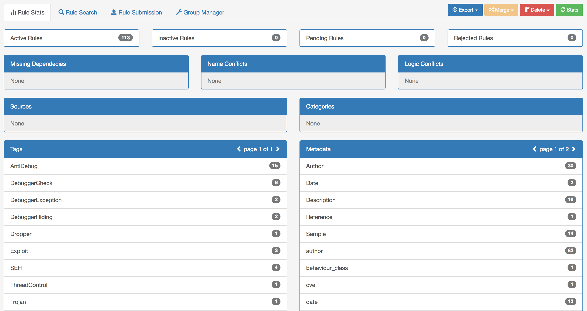
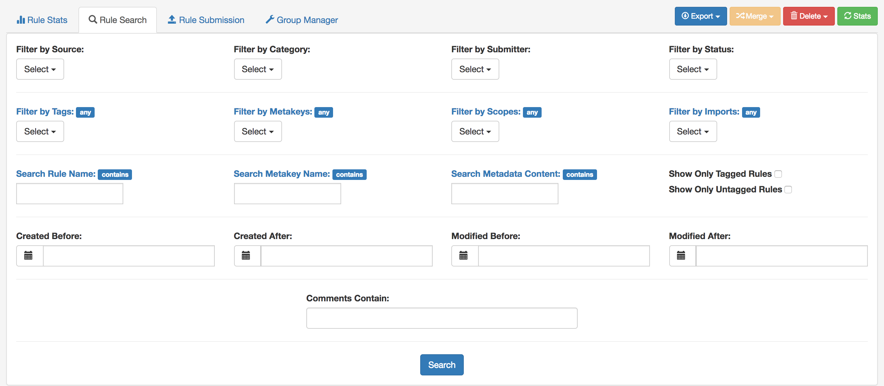
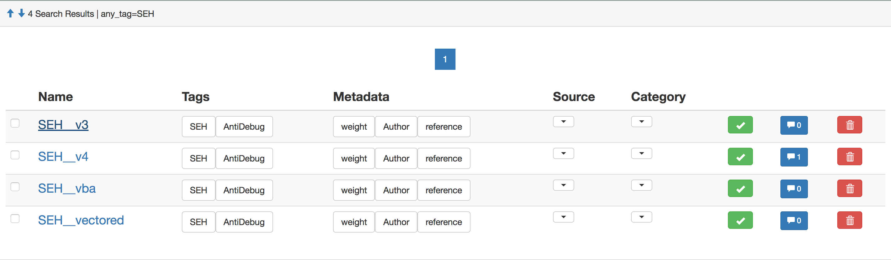

YaraGuardian
============
A django web interface for managing Yara rules. The manager enables users to:

    * Search for specific rules based on rule characteristics
    * Categorize and organize rules easily and in bulk
    * Make bulk edits on desired/filtered rules
    * Track characteristics of the entire rule repository
    * Automatically prevent and detect duplicate entries

Rule Stats Summary
------------------
Get stats data on the entire rule repository

Rule Search Form
----------------
Search, manage, and export rules matching specific criteria

Rule Search Results
-------------------
View and perform in-place edits on search results

Rule Edit Form
--------------
Modify or update a large set of rules based on various characteristics

Installation and Configuration Instructions (Development environment)
---------------------------------------------------------------------
1. Base django application requirements can be installed via vagrantfile or install.sh
    * Be sure to review install.sh beforehand as it contains default configs for psql

2. Settings are specified either via ENV variables or the config.json file
    * Default behavior is to use ENV variables
    * In order to use the config.json file instead, you must:
        - comment-out/remove line 22 in YaraGuardian/settings.py
        - uncomment lines 25-26 in YaraGuardian/settings.py

3. Use the Django manage.py to create initial tables and superuser
    * source .pyenv/bin/activate
    * python manage.py migrate
    * python manage.py createsuperuser

4. Run the server
    *  python manage.py runserver 0.0.0.0:8000

Configurable settings
---------------------
The following are the available configurable settings to be specified via environment variables or the config.json file:

  * SECRET_KEY
      - Required

  * DATABASE_NAME
      - Required

  * DATABASE_USER
      - Required

  * DATABASE_PASS
      - Required

  * DATABASE_HOST
      - Optional, defaults to '127.0.0.1'

  * DATABASE_PORT
      - Optional, defaults to '5432'

  * DEBUG
      - Optional, defaults to 'False'
      - WARNING: This will cause email settings to be ignored and redirect email output to console

  * ALLOWED_HOSTS
      - Optional, defaults to []

  * GUEST_REGISTRATION
      - Optional, defaults to 'DISABLED'

  * EMAIL_HOST
      - SMTP server authentication host
      - Optional, defaults to 'smtp.gmail.com'

  * EMAIL_PORT
      - SMTP server authentication port
      - Optional, defaults to '587'

  * EMAIL_USER
      - SMTP server authentication username
      - Required if not in Debug mode

  * EMAIL_PASSWORD
      - SMTP server authentication password
      - Required if not in Debug mode

  * EMAIL_USE_TLS
      - SMTP server authentication TLS enforced
      - Optional, defaults to 'True'

  * GOOGLE_OAUTH2_KEY
      - Social authentication key for Google authentication
      - Optional, defaults to None
      - If not specified, Google login will be disabled

  * GOOGLE_OAUTH2_SECRET
      - Social authentication secret for Google authentication
      - Optional, defaults to None
      - If not specified, Google login will be disabled

  * REDIRECT_HTTPS
      - Force headers to HTTPS (used when behind a reverse proxy)
      - Optional, defaults to 'False'

  * HIDE_API_DOCS
      - Disables API endpoint documentation
      - Optional, defaults to 'False'

  * GOOGLE_WHITELISTED_DOMAINS
      - Google domains allowed to authenticate using Google login
      - Optional, defaults to []

  * GOOGLE_WHITELISTED_EMAILS
      - Google email addresses allowed to authenticate using Google login
      - Optional, defaults to []

Registration Options
--------------------
Account registrations can be enabled by changing the "GUEST_REGISTRATION" config to either "INVITE" or "PUBLIC".

"INVITE" registration requires that a registration token be sent to the prospective guest. Tokens can be generated within the 'Admin Console'.

"PUBLIC" registration is completely open. Anyone who signs up can create an account.

Additional Commands / Utilities
-------------------------------
Yara rule files can be ingested automatically using the following command line Utilities.

  - UploadDirectory: This command will recursively traverse specified directories and process all yara rule files present
      ~~~
      source .pyenv/bin/activate
      python manage.py UploadDirectory {DIRECTORIES} --source={SOURCE} --category={CATEGORY} --user={USER}
      ~~~

  - UploadMasterFile: This command will process a master file and its associated imports
      ~~~
      source .pyenv/bin/activate
      python manage.py UploadMasterFile {MASTERFILES} --source={SOURCE} --category={CATEGORY} --user={USER}
      ~~~

Rule Access
-----------
- Each user has their own rule context/corpus which they completely control
  * Each rule context/corpus operates individually from all others
  * Users can share/collaborate on different contexts
  * Members are only able to View and Submit Rules.
  * Owner/admins of a context are able to View, Add, Edit, and Delete Rules.
  * Owner/admins of a context can be manage Sources and Categories
  * Owner is the only one who can manage members/admins

- Additional contexts can be generated

REST API Driven
---------------
Uses Django REST Framework so you can automate or build a new UI for rule management. Endpoint documentation can be found at /API on a running instance of YaraGuardian.

Contributing
------------
For those who are interested in contributing to YaraGuardian, please take a moment to look over the [contribution guidelines](./CONTRIBUTING.md).
